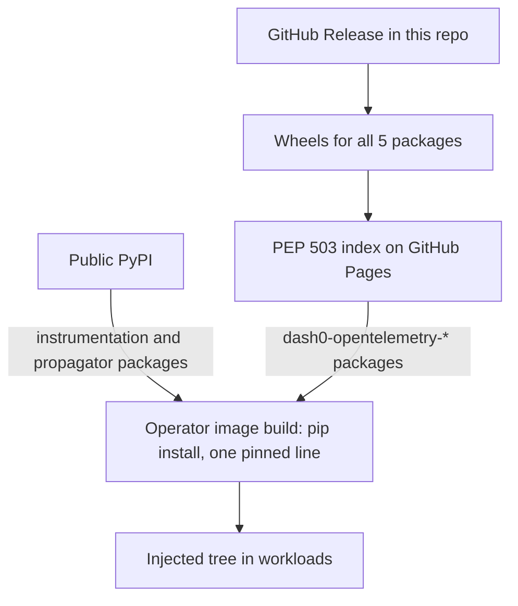

# Publishing the Dash0 OpenTelemetry Python distribution

## Summary

Publish the distribution and its four vendored packages — renamed under `dash0-opentelemetry-*` — as wheels on a self-hosted PEP 503 index served from GitHub Pages. This repo becomes the single owner of the complete injected Python tree (instrumentations and propagators included), versioned with independent semver; the dash0-operator consumes it as one pinned requirement line.

---

## Problem Frame

The distribution exists to be injected into workloads by the dash0-operator, which is its only consumer for now. Today the operator curates its own Python tree: upstream `opentelemetry-distro==0.60b1` plus roughly fifty individually pinned instrumentation and propagator packages (dash0-operator: `images/instrumentation/python/requirements.txt`). This distribution pins a different version family (SDK `1.44.0`, instrumentation `0.65b0`). The two families must move in lockstep, so split ownership across two repos guarantees version skew over time.

Publication has been blocked by the open decisions in `RELEASING.rst`: four of the five workspace packages are vendored from `open-telemetry/opentelemetry-packaging` and carry `opentelemetry-*` names that upstream has not yet released. Publishing those names to public PyPI would claim, first-come-first-served, names the OpenTelemetry project intends to publish itself — namespace squatting toward a project this repo is trying to upstream work into. Public PyPI also serves no actual consumer today while creating public registry commitments.

---

## Key Decisions

- **Self-hosted PEP 503 index over public PyPI.** With the operator as sole consumer, a static simple index on GitHub Pages gives pip-native consumption (`--extra-index-url`) with zero public registry commitment. The wheels are the same artifacts a future PyPI publication would push, so graduating later is purely additive. Chosen over a prebuilt OCI tree image (would have moved the operator's build machinery here) and over GitHub release assets alone (poor version-bump automation).
- **Rename distribution names only, now, while nothing is published.** The vendored packages become `dash0-opentelemetry-*` at the distribution level; import paths (`opentelemetry.exporter.otlp._proto...`) and entry point names (`otlp_proto_http`, `otlp_proto_grpc`) stay upstream-shaped. Renaming imports would be a fork that makes the eventual switch to official upstream packages a migration instead of a dependency swap.
- **Full injected tree owned in this repo.** The instrumentation and propagator set moves from the operator's requirements file into this repo, pinned and tested together with the distro. Mirrors how `@dash0/opentelemetry` works for Node.js.
- **Independent semver for the distribution.** The version does not track the upstream SDK; bundled upstream versions are recorded in the changelog and package metadata. The distribution spans two upstream version families (SDK 1.x, instrumentation 0.xb0), so mirroring either would mislead.
- **Defensive namespace registration on public PyPI.** `--extra-index-url` consumption is exposed to dependency confusion: unregistered `dash0-*` names on public PyPI could be squatted with higher versions. The concrete names are registered defensively now; a `dash0` namespace grant (PEP 752, accepted 2026-06-29) is applied for once PyPI's process goes live.

---

## Requirements

**Publishing channel**

- R1. Each GitHub Release publishes wheels and sdists for all five workspace packages to a PEP 503 simple index served from GitHub Pages.
- R2. The index is publicly readable and consumable with `pip install --extra-index-url`; no authentication required.
- R3. Published artifacts are byte-identical to what a future public PyPI publication would push, so PyPI graduation requires no rebuild or renaming.

**Package naming**

- R4. The vendored packages are renamed at the distribution level: `dash0-opentelemetry-pyproto` and `dash0-opentelemetry-exporter-otlp-pyproto-{common,http,grpc}`. `dash0-opentelemetry-distro` keeps its name.
- R5. Import paths and entry point names remain unchanged from the upstream vendoring source.
- R6. When upstream publishes the official pyproto packages, the distribution switches its dependencies to them and the renamed packages are deprecated.

**Full-tree ownership**

- R7. This repo defines and exactly pins the complete injected package set: distro, exporters, instrumentations, and propagators, all within one consistent upstream version family.
- R8. The operator's Python package curation reduces to a single pinned reference to this repo's release (mechanism open, see the outstanding questions).
- R9. CI in this repo validates the full pinned set together — the tree the operator installs is the tree this repo tested.

**Versioning and release**

- R10. The distribution is versioned independently with semver; the bundled upstream SDK and instrumentation versions are recorded in the changelog and package metadata.
- R11. Releases continue to be triggered by publishing a GitHub Release whose tag matches the version.

**Namespace protection**

- R12. Dash0 creates a PyPI organization account (corporate tier) — the account type that can hold projects jointly and apply for a namespace grant.
- R13. Every `dash0-*` name published to the self-hosted index is defensively registered on public PyPI no later than its first index publication, after verifying the name is unclaimed. Registration uses a pending trusted publisher or an honest dev-version stub whose description states the name is registered by Dash0.
- R14. The operator installs from the index with hash-pinned requirements as defense in depth against index-resolution surprises.
- R15. Dash0 applies for a restricted `dash0` namespace grant on PyPI once the PEP 755 grant process goes live.

---

## Scope Boundaries

**Deferred for later**

- Public PyPI publication of the real packages, and direct pip-install support for end users (non-Kubernetes hosts, serverless, manual setup). The channel choice keeps this a purely additive step.

**Not pursued**

- Publishing a prebuilt OCI tree image as the operator channel — rejected in favor of the pip-shaped channel.
- Moving the operator's image build machinery into this repo: the dual-libc (glibc/musl) builds, tree flattening, and `sitecustomize.py` stay in dash0-operator. Only the package curation moves here.

---

## Dependencies / Assumptions

- Upstream `open-telemetry/opentelemetry-packaging` eventually publishes the official pyproto packages; the renamed `dash0-*` copies are a temporary shim until then (the preferred resolution already recorded in `RELEASING.rst`).
- PEP 752 was accepted on 2026-06-29, but PEP 755 (PyPI's grant policy) is still a draft; the timing of namespace grants on PyPI is unknown, which is why R13's per-name registration cannot wait for R15.
- Renovate in the operator repo can track versions on a custom PyPI-compatible index for automated bumps.
- Some transitive dependencies of the instrumentation set have native extensions (for example `wrapt`), so the operator's dual-libc builds remain necessary regardless of this change.
- The renamed distributions ship the same module files upstream will eventually ship. Harmless in the operator's controlled tree; a documented caveat for any pip user who installs both during the transition window.

---

## Outstanding Questions

**Deferred to planning**

- How the full tree is expressed: a `full` extra on the distro, a metapackage, or a published constraints file consumed by the operator build.
- Version scheme for the renamed vendored packages: keep tracking the upstream vendoring source (currently `1.44.0.dev`-style) or align with the distro's independent semver.
- Index layout and URL, and how the release workflow publishes to GitHub Pages.
- The role of TestPyPI going forward: retire it, or keep it as a release rehearsal target alongside the index.

---

## Sources

- `RELEASING.rst` — the previously open publishing decisions this doc resolves.
- `packages/dash0-opentelemetry-distro/pyproject.toml` — dependency pins and the lockstep-version rationale.
- dash0-operator: `images/instrumentation/python/requirements.txt`, `images/instrumentation/Dockerfile`, `images/instrumentation/python/sitecustomize.py` — the consuming build this channel feeds.
- dash0-operator: `images/instrumentation/node.js/package.json` — the Node.js precedent (registry-published distro, one pinned line).
- [PEP 752](https://peps.python.org/pep-0752/) (accepted 2026-06-29), [PEP 755](https://peps.python.org/pep-0755/) (draft), [PyPI organization accounts](https://docs.pypi.org/organization-accounts/).
