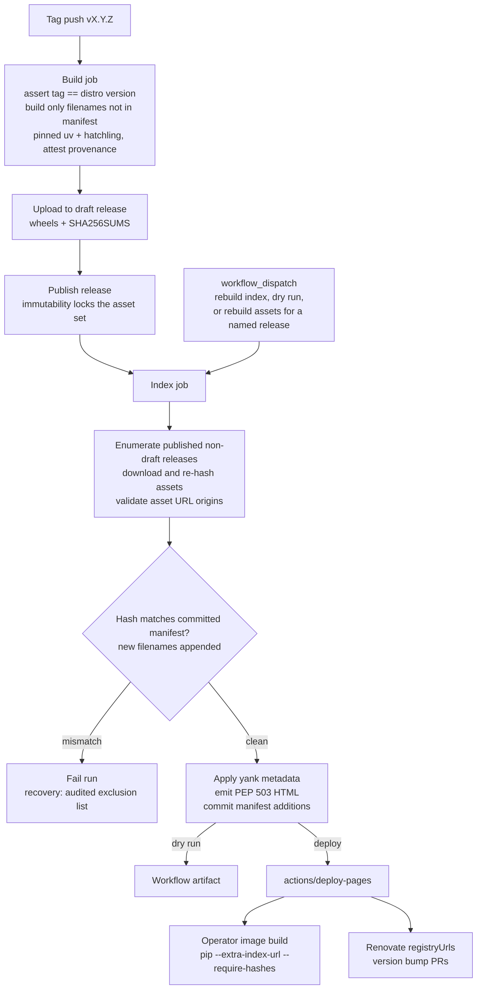

# feat: Publish the distro on a self-hosted PEP 503 index

## Summary

Rename the four vendored packages to `dash0-opentelemetry-*`, replace the PyPI publish pipeline with one that attaches wheels to GitHub Releases and serves a static PEP 503 simple index from GitHub Pages, and defensively register the new names on public PyPI. The dash0-operator then consumes the distribution as one pinned, hash-checked requirement line.

---

## Problem Frame

The distribution cannot be published under its current package names: four workspace packages carry `opentelemetry-*` names vendored from `open-telemetry/opentelemetry-packaging`, which upstream has not released — publishing them to public PyPI would squat names upstream intends to use (see origin: docs/brainstorms/2026-07-22-distro-publishing-requirements.md). The existing `.github/workflows/release.yml` publishes all five packages to PyPI/TestPyPI and is gated on exactly this decision. Meanwhile the sole consumer, the dash0-operator, still builds its Python tree from upstream `opentelemetry-distro` pins in its own repo.

The full-tree ownership decided in the brainstorm has already landed: the distro's `pyproject.toml` ships the complete curated instrumentation set as exact-pinned dependencies, guarded by `packages/dash0-opentelemetry-distro/tests/test_instrumentations.py` and `scripts/check_pinned_dependencies.py`. What remains is the publication channel itself.

---

## Requirements

**Renaming**

- R1. The four vendored packages are renamed at the distribution level: `dash0-opentelemetry-pyproto`, `dash0-opentelemetry-exporter-otlp-pyproto-{common,http,grpc}`. Import paths, entry-point names, and directory names are unchanged. (origin R4, R5)
- R2. The distro pins the renamed exporter dependencies exactly (`==`), like every other dependency; cross-pins among the vendored packages use the new names.
- R3. Every reference to the old names is updated: root `[tool.uv.sources]`, `uv.lock`, workflow build loops, `examples/dash0-distro-flask/verify_pyproto.py`, `.github/dependabot.yml` group pattern, and docs.

**Publishing pipeline**

- R4. Pushing a release tag (`vX.Y.Z`, where `X.Y.Z` is the distro version) builds wheels and sdists for all five packages, asserts the tag matches the distro version, uploads them with a `SHA256SUMS` sidecar to a draft release, and publishes the release as the final build step — a release is never published with an incomplete asset set. (origin R1)
- R5. The pipeline regenerates the PEP 503 simple index from all published, non-draft releases and deploys it to GitHub Pages; file URLs point at release assets with `#sha256=` fragments. (origin R2, R3)
- R6. Index generation re-hashes asset bytes and fails hard when a filename's hash differs from the committed manifest of previously indexed files (immutability guard); the manifest lives in this repo so tampering shows up in branch-protected git history.
- R7. A `workflow_dispatch` run can rebuild and redeploy the index without rebuilding artifacts (failure recovery, yank propagation), can run as a dry run that produces the index as a workflow artifact without deploying, and can build and upload assets for a named existing release (recovery for runs dropped by the concurrency queue, which holds at most one pending run).
- R8. A published version is withdrawn by marking it yanked in index metadata (PEP 592), never by deleting a release; releases are append-only. A git-audited filename-level exclusion list lets index generation skip a poisoned filename when the immutability guard would otherwise block all future index runs.
- R9. Release workflow runs queue rather than cancel each other.
- R10. PyPI and TestPyPI publishing of the real packages is removed from `release.yml`. (origin: public PyPI deferred)

**Supply-chain hardening**

- R16. Repo settings are hardened before the first release: GitHub's immutable-releases setting enabled, a tag ruleset forbidding tag update and deletion, and deployment-branch protection on the `github-pages` and `pypi` environments.
- R17. The build job publishes provenance attestations for all ten artifacts; the index job runs on the standard library alone — no third-party code executes in the job that controls consumer-visible hashes.
- R18. Only new artifacts are built: packages whose wheel/sdist filenames already appear in the manifest are skipped, so unchanged vendored packages are never rebuilt (rebuilds are not byte-stable across toolchain upgrades, and a changed-bytes re-upload would trip the R6 guard). The build toolchain (uv version, hatchling via build constraints) is pinned in the workflow.
- R19. Index generation validates that every asset URL matches the expected GitHub release-asset origin for this repository and aborts on mismatch.

**Versioning**

- R11. The distro versions with independent semver, starting `0.1.0`; the vendored packages release as upstream-base versions with `.postN` increments for dash0-side changes (first release: `1.44.0`); `.dev` versions never reach the index. (origin R10, R11)

**Name reservation**

- R12. A dedicated workflow publishes stub packages (version `0.0.0.devN`, README stating the name is registered by Dash0 and pointing at the real index) for all five names to public PyPI via trusted publishing with skip-existing semantics; `N` increments on refresh because PyPI permanently forbids filename reuse. (origin R13)
- R13. The admin prerequisites — PyPI organization account, pending trusted publishers bound to the reservation workflow only, GitHub Pages enablement — are documented as a runbook. (origin R12)

**Documentation**

- R14. `RELEASING.rst` is rewritten: the three open decisions recorded as resolved, the new release process, the recovery and yank runbooks, and the consumer contract (index URL, `--extra-index-url`, hash-pinned installs, `--only-binary :all:`, Renovate `registryUrls`). (documents the consumer contract, origin R14)
- R15. `README.rst`, `CONTRIBUTING.rst`, and `CHANGELOG.rst` reflect the renames and the new installation reality.

---

## Key Technical Decisions

- **Wheels live on GitHub Releases; Pages serves only generated HTML.** The index is regenerated statelessly from the full set of published releases on every run and deployed with `actions/deploy-pages` — no `gh-pages` branch, no binary blobs in git history, no drift to reconcile. Releases are assembled draft-first: assets upload to a draft and the release publishes only when the set is complete, because GitHub's immutable-releases setting (R16) freezes assets at publish time — publishing first and uploading after would fail, and without the setting, assets are mutable by anyone with `contents: write`. Immutability is enforced, not assumed: the repo setting plus a tag ruleset, backed by the committed-manifest guard (R6).
- **The script emits the simple-index HTML itself (stdlib only).** dumb-pypi was the planned generator, but its input model joins a single `--packages-url` base with each filename — it cannot express per-file URLs, and GitHub release-asset URLs embed the release tag. The fallback the plan reserved is the primary path: ~40 lines of tested PEP 503/592 HTML emission, which also removes all third-party code from the job that controls what consumers' lockfiles hash-pin.
- **Committed hash manifest as the trust source; `SHA256SUMS` sidecar as convenience.** The generator downloads and re-hashes asset bytes (five pure-Python packages — trivially cheap) and records accepted `filename → sha256` entries in a manifest committed to this repo. The R6 guard compares against that manifest, so rewriting both an asset and its sidecar cannot pass silently — the sidecar is a human-readable convenience, not what the index trusts. This matters because hash pinning protects consumers at install time, but lock generation (pip-compile, Renovate bumps) takes hashes from the live index — the manifest anchors that trust in audited git history. Manifest commits are pushed by a dedicated credential (deploy key or GitHub App) that is the sole ruleset-bypass actor; the committing step is gated behind a protected environment restricted to the default branch and release tags (so a dispatch from an arbitrary ref cannot reach it); a CI check on any push touching the manifest asserts the diff is strictly additive; dry runs never commit.
- **Append-only releases, yank via metadata.** Deleting a release would 404 asset URLs baked into every consumer lockfile that pins that version — pip re-resolves via the index on every operator image build. Withdrawal is a yank flag in a metadata file in this repo, applied at index generation and propagated with the rebuild dispatch (R7).
- **Stub versions are `0.0.0.devN`, incrementing on refresh.** Always below every real version, never equal to one (equal name+version on both indexes would make pip fetch the PyPI stub and fail hash checking), and dev-only so default pip resolution never selects it. `N` increments because PyPI permanently forbids re-uploading a filename, even after deletion — a "refresh the stub" runbook step at a fixed version would dead-end.
- **Vendored packages: upstream-base + `.postN`.** Unique version per dash0-side change keeps filenames unique by construction (backstopped by R6), stays PEP 440-sortable for Renovate, and avoids local versions (`+suffix`), which PyPI rejects — preserving the additive-PyPI-graduation property.
- **Distribution-name-only rename, directories unchanged.** `CONTRIBUTING.rst` mandates keeping the vendored packages close to upstream; directory names are not coupled to distribution names in a uv workspace, and the equivalence-test conftests assert on `pyproto` path substrings.
- **TestPyPI retired.** The rehearsal path is the R7 dry run: build the index into a workflow artifact without deploying.
- **Consumer contract: pip with `--extra-index-url` + `--require-hashes` + `--only-binary :all:`.** Hash pinning defeats dependency confusion regardless of index priority (pip picks highest version across indexes; defensive registration closes the squatting hole); `--only-binary` closes the sdist build-dependency hole that `--require-hashes` does not cover. Renovate needs explicit `registryUrls` (it does not reliably extract `--extra-index-url` from requirements files); the index URL must end in `/simple/` so Renovate skips the JSON API. The operator's lock regeneration can additionally verify artifacts with `gh attestation verify` against the R17 provenance attestations.

---

## High-Level Technical Design

The whole workflow runs under a queued (not cancelling) concurrency group: two releases published close together must both be indexed, and a cancelled run would skip indexing its own release.

---

## Implementation Units

### U1. Rename the vendored distributions and pin the exporter dependencies

- **Goal:** All four vendored packages carry `dash0-opentelemetry-*` distribution names; the workspace, lockfile, CI, example, and guardrail scripts agree.
- **Requirements:** R1, R2, R3, R11 (version files move to their release form)
- **Dependencies:** none
- **Files:** `packages/opentelemetry-pyproto/pyproject.toml`, `packages/opentelemetry-exporter-otlp-pyproto-{common,http,grpc}/pyproject.toml`, `packages/dash0-opentelemetry-distro/pyproject.toml`, `pyproject.toml` (root `[tool.uv.sources]`), `uv.lock` (regenerate), version files (`packages/opentelemetry-pyproto/src/opentelemetry/_proto/version/__init__.py`, `packages/opentelemetry-exporter-otlp-pyproto-{common,http,grpc}/src/opentelemetry/exporter/otlp/_proto/{common,http,grpc}/version/__init__.py`, `packages/dash0-opentelemetry-distro/src/dash0/opentelemetry/version.py`), `.github/workflows/ci.yml`, `.github/workflows/release.yml` (build loop names; full rework is U3), `examples/dash0-distro-flask/verify_pyproto.py`, `.github/dependabot.yml`, `CHANGELOG.rst`
- **Approach:** Rename `[project].name` in each vendored pyproject; update cross-dep pins (`-http`/`-grpc` → `-common`, `-common` → `-pyproto`) to the new names; pin the distro's two exporter deps `== 1.44.0` (unpinned today, which lets pip resolve a distro from release N against exporters from release N+3 once the index holds multiple versions); rename the `[tool.uv.sources]` keys; set version files to release form (`1.44.0`; distro `0.1.0`); regenerate `uv.lock`. Update `verify_pyproto.py`'s `AGENT_PACKAGES` tuple (it queries `importlib.metadata` by distribution name) and extend its requirement assertion to accept the `dash0-opentelemetry-` prefix — it rejects any transitive requirement that neither starts with `opentelemetry-` nor sits in `ALLOWED_NON_OTEL_REQUIREMENTS`, so the renamed cross-dependencies would abort the e2e probe. Directories stay as-is. `check_pinned_dependencies.py` needs no change — its workspace exemption reads `[tool.uv.sources]` dynamically, but confirm the distro's new `==` exporter pins pass its closure check.
- **Patterns to follow:** `CONTRIBUTING.rst` vendoring rule (touch only `name =` and version/pin lines under the vendored packages, nothing in `src/`); pyproject rationale-comment style — update the "not resolvable from PyPI" comment block at `packages/dash0-opentelemetry-distro/pyproject.toml:33-36`, which becomes stale.
- **Test scenarios:**
  - `uv build --package` succeeds for all five new names and produces `dash0_opentelemetry_*` wheel filenames
  - The built distro wheel's metadata requires the renamed exporters with exact pins
  - `uv lock --check` passes; `scripts/check_pinned_dependencies.py` passes with the renamed workspace members exempted
  - Existing distro test suite and the vendored packages' equivalence-test conftests (`"pyproto" not in __file__` path assertions) still pass
  - `examples/dash0-distro-flask` e2e: `verify_pyproto.py` resolves metadata for all five renamed distributions
- **Verification:** Full CI green, including the example e2e workflow.

### U2. Index generator script

- **Goal:** A tested script turns the repo's published releases into a deployable PEP 503 simple index.
- **Requirements:** R5, R6, R8
- **Dependencies:** none (developable in parallel with U1; consumes whatever names releases carry)
- **Files:** `scripts/build_simple_index.py` (new), `scripts/tests/test_build_simple_index.py` (new), `scripts/index-yanked.toml` (new, empty initially), `scripts/index-manifest.json` (new, the committed `filename → sha256` trust anchor), `.github/workflows/ci.yml` (run the script's tests)
- **Approach:** Enumerate published, non-draft releases via the GitHub API (paginate; 30-releases/100-assets page caps bite within a year); download and re-hash asset bytes; verify against and extend `scripts/index-manifest.json` (the workflow commits new entries back, so the trust anchor lives in branch-protected git history, not in mutable release assets); emit the PEP 503 site directly (project list page, per-project pages with `#sha256=` fragments and PEP 592 `data-yanked` markers). Enforce the immutability guard: any asset whose hash differs from the manifest entry for that filename aborts generation. Only filenames matching a strict wheel/sdist pattern for the five expected project names are indexed; unexpected assets are ignored. Every asset URL must match the expected GitHub release-asset origin for this repository — any other origin aborts generation (R19). Filenames listed in `scripts/index-excluded.toml` (git-audited) are skipped by both the guard and the index — the recovery path when the guard trips on a poisoned filename (R8). Apply yank flags from `scripts/index-yanked.toml`. Deduplicate identical filename+hash pairs (vendored packages re-uploaded unchanged across releases). GitHub pre-releases are indexed only when their version is a PEP 440 pre-release; drafts are excluded by the API filter. The script's own dependencies (dumb-pypi et al.) install from `scripts/index-requirements.txt` with `--require-hashes` — the pipeline holds itself to the standard it sets for consumers.
- **Test scenarios:** (fixture: fabricated release/asset JSON + SHA256SUMS content)
  - Two releases sharing an identical vendored wheel (same filename, same hash) → one index entry
  - Asset whose recomputed hash differs from the manifest entry → generation fails naming the filename and both hashes
  - Asset filename not matching the expected project-name/wheel pattern (hostile or stray upload) → ignored, not indexed
  - Asset URL with unexpected origin → generation fails
  - Filename in `index-excluded.toml` → skipped by both guard and index
  - Draft release → excluded; GitHub pre-release with PEP 440 `rc` version → included
  - Yanked version in `index-yanked.toml` → entry carries the PEP 592 yanked marker
  - Project URLs and directory names are PEP 503-normalized (`dash0_opentelemetry_x` and `dash0-opentelemetry-x` collapse to one project)
  - Release list spanning multiple API pages → all assets indexed
- **Verification:** Script tests pass in CI; a local run against the real repo (once one release exists) produces an index pip can resolve from via `--extra-index-url file://...`.

### U3. Release workflow rework

- **Goal:** `release.yml` implements the build → assets → index → Pages pipeline and no longer publishes to PyPI.
- **Requirements:** R4, R5, R7, R9, R10, R17, R18
- **Dependencies:** U1 (names), U2 (script)
- **Files:** `.github/workflows/release.yml` (rewrite)
- **Approach:** Draft-first build job, triggered by pushing a `vX.Y.Z` tag: assert the tag equals the distro version from `version.py` and that all versions are release-form (no `.dev`); build only packages whose wheel/sdist filenames are absent from `scripts/index-manifest.json` (R18), with the uv version pinned and hatchling pinned via a build-constraints file; write `SHA256SUMS`; attest provenance (`actions/attest-build-provenance`); create or locate the draft release for the tag, upload assets idempotently (skip when an existing asset's hash matches, fail when it differs), and publish the release as the final step — immutability (R16) then locks a complete asset set. Index job, triggered by `release: [published]`: run `scripts/build_simple_index.py`, commit manifest additions (dedicated push credential per the manifest KTD), deploy with `actions/upload-pages-artifact` + `actions/deploy-pages`. `workflow_dispatch` inputs: rebuild-index-only (skip build/upload), dry-run (index as workflow artifact, no deploy, no manifest commit), and rebuild-assets-for-release (named tag; recovery for concurrency-cancelled runs, R7). Workflow-level `concurrency: { group: release-publish, cancel-in-progress: false }`. Permissions scoped per job, not per workflow: build gets `contents: write` + `attestations: write`/`id-token: write` only; the index job gets `contents: read`+`write` (manifest commit), `pages: write`, `id-token: write`. Event fields (`tag_name` etc.) reach `run:` scripts via `env:` indirection, never inline `${{ }}` interpolation (script-injection sink); third-party actions are SHA-pinned; no dependency cache in this workflow (a cache is a cross-workflow write channel into the release build). Delete the PyPI/TestPyPI publish job and the `testpypi` environment reference.
- **Test scenarios:** Test expectation: none — workflow YAML is exercised by the verification runs below, not unit tests.
- **Verification:** Dry-run dispatch produces an index artifact that resolves locally with pip; a `0.1.0rc1` pre-release exercises the full path end-to-end (assets, index, Pages) before the first stable release; re-running the workflow on the same release succeeds without duplicate-asset errors.

### U4. PyPI name-reservation stub workflow

- **Goal:** The five `dash0-opentelemetry-*` names are claimed on public PyPI by honest stubs before the rename lands on the default branch and makes them guessable.
- **Requirements:** R12
- **Dependencies:** none — the names are final as of this plan; run org setup and stub publication immediately, and gate U1's merge on the stubs being live
- **Files:** `.github/workflows/reserve-pypi-names.yml` (new)
- **Approach:** The workflow inlines stub generation (a small loop writing each stub's `pyproject.toml` and README, then `uv build`) — no dedicated script or test file for a one-time operation; the stubs are verified by the PyPI upload itself. Stubs carry version `0.0.0.devN` and a README stating the name is registered by Dash0, pointing at the real index and repo — an actively-maintained stub, which keeps it outside PEP 541 reclaim. The `workflow_dispatch` workflow publishes them with `pypa/gh-action-pypi-publish` using `skip-existing: true`, so a partial failure (one name already claimed) re-runs safely. Pending trusted publishers on PyPI must be bound to this workflow filename only — never `release.yml` — so a release can never accidentally publish real packages to PyPI (the old workflow would otherwise succeed once publishers exist), AND to a `pypi` GitHub environment with required reviewers and a default-branch-only deployment policy — an unconstrained publisher binding accepts OIDC tokens from any ref, making it a standing publish capability to the public names for anyone with repo write. After the one-time reservation run succeeds, remove the trusted publishers on PyPI (re-adding one is a two-minute admin task if a stub ever needs refreshing). Before creating the pending publishers, check each name is still unclaimed; pending publishers do not reserve names, only the first upload does, so this workflow runs immediately after setup.
- **Test scenarios:** Test expectation: none — one-time workflow with inline generation; verified by the PyPI upload itself and the verification steps below.
- **Verification:** All five projects exist on PyPI under the Dash0 org, each showing the stub README; `pip install dash0-opentelemetry-distro` from PyPI alone installs nothing usable (dev-only version is not selected by default resolution).

### U5. Documentation and runbooks

- **Goal:** The release process, admin prerequisites, recovery paths, and consumer contract are documented; stale claims removed.
- **Requirements:** R13, R14, R15, R16
- **Dependencies:** U1–U4 (documents their final shape)
- **Files:** `RELEASING.rst` (rewrite), `README.rst`, `packages/dash0-opentelemetry-distro/README.rst`, `CONTRIBUTING.rst`, `CHANGELOG.rst`
- **Approach:** `RELEASING.rst`: record the three formerly-open decisions as resolved (naming → renamed + reserved; scope → all five to the self-hosted index; versioning → independent semver / upstream-base+postN); document the release checklist (version bumps, changelog, tag = distro version), the append-only + yank policy with runbooks (R7 dispatch), the admin one-time setup (PyPI org with enforced 2FA; pending publishers bound to the reservation workflow + protected `pypi` environment, with publisher removal after the run as a mandatory numbered step including a verification check; Pages enablement; GitHub immutable-releases setting; tag ruleset on `v*` forbidding update/delete; `github-pages` environment policy allowing the default branch AND the `v*` tag pattern — release runs deploy from tag refs; the manifest push credential and its ruleset-bypass grant), the guard-tripped runbook (add the filename to `scripts/index-excluded.toml`, dispatch an index rebuild) next to the yank runbook, a note that vendored `.postN` releases require a coordinated distro release (exact `==` pins do not match `.postN`), and the consumer contract from the KTDs, including a Renovate `registryUrls` snippet, the `/simple/`-suffixed index URL, and optional `gh attestation verify` at lock regeneration. `README.rst`: replace the "not yet published" installation-status section with index-based install instructions. Keep the module-file-collision caveat from the origin doc as a consumer footnote.
- **Test scenarios:** Test expectation: none — documentation-only unit.
- **Verification:** No remaining references to TestPyPI publishing or the old package names anywhere in docs (`grep` sweep); `RELEASING.rst` answers "how do I pull a broken release" without reading workflow source.

---

## Scope Boundaries

**Deferred to Follow-Up Work** (dash0-operator repo)

- Collapse `images/instrumentation/python/requirements.txt` to `dash0-opentelemetry-distro==X.Y.Z` resolved against the Pages index; generate the fully-hashed lockfile (`pip-compile --generate-hashes` or uv export) spanning both indexes; install with `--require-hashes --only-binary :all:`.
- Renovate config: explicit `registryUrls` for the index (the `--extra-index-url` line in requirements files is not reliably picked up). Note: age-based Renovate rules will not fire for index packages (no JSON API timestamps).
- Validate the operator's Python tests against the version-family jump (upstream `0.60b1` → this distro's `0.65b0` family) and the distro's entry points replacing upstream `opentelemetry-distro`'s.

**Deferred for later** (origin)

- Public PyPI publication of the real packages and direct pip-user support. The artifacts and (already-claimed) names make this additive when it happens.

**Outside this plan** (origin: not pursued)

- OCI prebuilt-tree image channel; moving the operator's dual-libc build machinery, `sitecustomize.py`, or tree flattening into this repo.

---

## Risks & Dependencies

- **The repo must be public.** Release asset URLs and GitHub Pages both require it (Pages on private repos needs Enterprise). Verify before U3; if the repo is private, the channel design fails wholesale.
- **Lock-time trust concentrates in the Pages deploy authority.** Hash pinning protects consumers at install time; lock regeneration trusts the live index. Anyone who can deploy Pages controls future lockfile hashes — hence the environment protection (R16), the committed manifest (R6), and attestations (R17) as independent anchors. No custom domain is configured for the Pages site; if one ever is, DNS must be created before it is set (dangling-DNS takeover).
- **Squatting window.** The `dash0-opentelemetry-*` names are guessable from this public work the moment U1 merges. Run U4 (org setup + stubs) as early as the names are final — it has no dependency on the pipeline.
- **Upstream pyproto publication** eventually obsoletes the renamed packages: switch the distro's deps to the official releases, deprecate the `dash0-*` stub-and-real packages (origin R6). No action now; the rename keeps that a dependency swap.
- **Renovate + uv lockfile maintenance against custom indexes** has an open upstream issue; the operator consumes via pip requirements files, which are unaffected — flag only if the operator later migrates its Docker build to uv (uv's `first-index` strategy would actually remove the dependency-confusion concern).
- **PEP 755 rollout timing unknown.** The `dash0` namespace grant (origin R15) is an operational follow-up owned outside this plan; the stubs cover the concrete names until then.

---

## Sources & Research

- Origin requirements: `docs/brainstorms/2026-07-22-distro-publishing-requirements.md`
- Full-tree ownership already implemented: `packages/dash0-opentelemetry-distro/pyproject.toml` (curated set + rationale comments), `packages/dash0-opentelemetry-distro/tests/test_instrumentations.py`, `scripts/check_pinned_dependencies.py` (closure check; dynamic workspace exemption via root `[tool.uv.sources]`)
- Rename ripple map: root `pyproject.toml`, `examples/dash0-distro-flask/verify_pyproto.py` (`AGENT_PACKAGES` by distribution name), `.github/dependabot.yml` (`opentelemetry-*` group pattern), equivalence-test conftests (path-substring assertions on `pyproto`)
- [PyPI pending trusted publishers](https://docs.pypi.org/trusted-publishers/creating-a-project-through-oidc/) — names are not reserved until first upload; org-level pending publishers shipped Nov 2025
- [pip issue #12910](https://github.com/pypa/pip/issues/12910) — `--extra-index-url` highest-version-wins is intended behavior; [PEP 708](https://peps.python.org/pep-0708/) (repository-API confusion mitigation) rejected April 2026 — hash pinning + defensive registration is the durable mitigation
- [Renovate pypi datasource](https://docs.renovatebot.com/modules/datasource/pypi/) — `/simple/`-suffixed `registryUrls` for static indexes; [issue #18028](https://github.com/renovatebot/renovate/issues/18028) — `--extra-index-url` extraction unreliable
- GitHub Pages limits (1 GB site, 100 MB file) vs Release assets (2 GB/file) — drove the assets-on-Releases KTD
